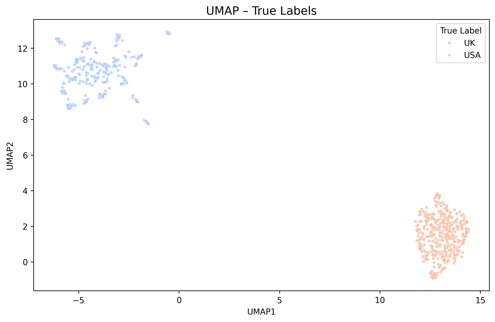
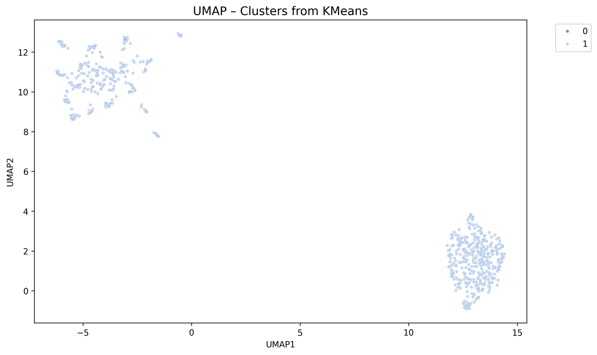
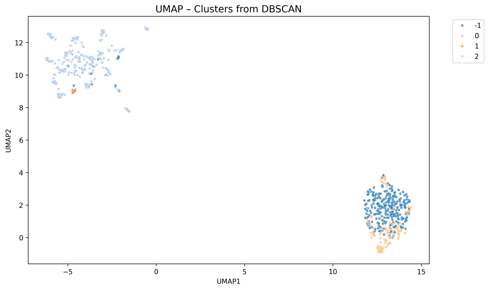
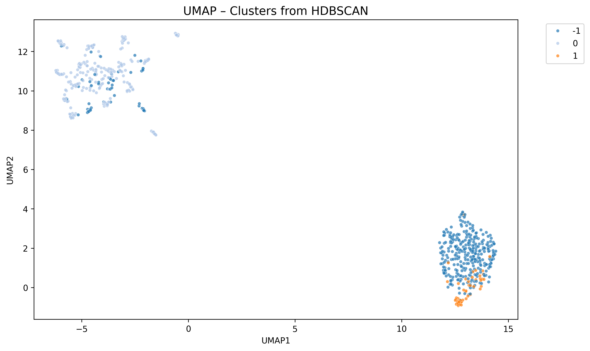
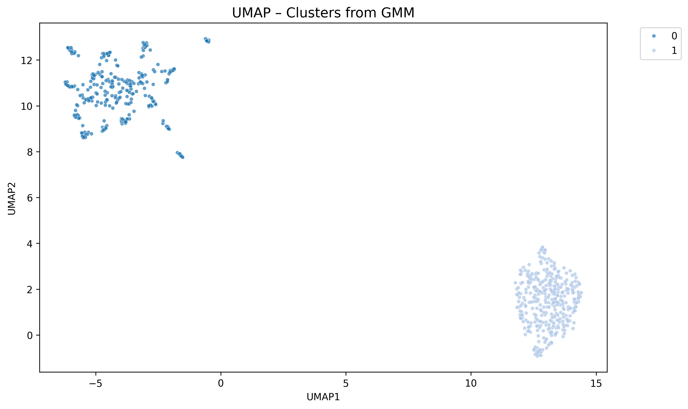

בס"ד  
אפרים אלגרבלי - 212451074  
אלי גובמן - 213662364  
---

# Exercise 2: Text Classification & Clustering (US vs UK)

This project analyzes parliamentary speeches from the US and UK to determine if they can be distinguished by their vocabulary and language patterns. We apply both unsupervised learning (clustering) and supervised learning (classification) techniques.

## 📂 Project Structure

- `data_cleaner.py`: Preprocesses raw text files (removes metadata, HTML, country names).
- `data_lemmatized.py`: Lemmatize raw text files.
- `BM25.py`: Converts cleaned text into numerical vectors using the BM25 algorithm.
- `result.py`: Performs unsupervised clustering (KMeans, DBSCAN, HDBSCAN, GMM) and visualizes results using UMAP.
- `classification.py`: Trains and evaluates 5 supervised classifiers using 10-fold cross-validation.

## 🚀 How to Run

1.  **Clean the Data**:
    ```bash
    python data_cleaner.py
    ```
    *   Input: Raw text files in `data/us/` and `data/uk/`.
    *   Output: Cleaned text in `data/cleaned_us/` and `data/cleaned_uk/`.

2.  **Generate Features (BM25)**:
    ```bash
    python BM25.py
    ```
    *   Output: Sparse matrices (`.npz`) and vocabulary files in `matrices/`.

3.  **Part A: Unsupervised Learning**:
    ```bash
    python result.py
    ```
    *   Output: UMAP visualization plots saved in `images/`.

4.  **Part B: Supervised Learning**:
    ```bash
    python classification.py
    ```
    *   Output: `classification_results.csv` with performance metrics.

---

## 📊 Part A: Analysis of Clustering Results

The `result.py` script generates UMAP visualizations saved in the `images/` folder. Here is how to interpret them based on the actual output:

### UMAP Projection
UMAP (Uniform Manifold Approximation and Projection) reduces the high-dimensional BM25 vectors (thousands of words) into 2 dimensions for visualization. Points that are close together in the plot are similar in terms of their word usage.

### 1. True Labels


- **What it shows**: The ground truth. Red points are US speeches, Blue points are UK speeches.
- **Interpretation**:
    - The plot shows **two very distinct, well-separated clusters**.
    - This indicates that the vocabulary and language patterns used in the US Congress vs. the UK Parliament are significantly different. The model can easily distinguish between them based on word usage alone.
    - **Why it looks like this**: The clear separation suggests distinct political terminologies (e.g., "Senator" vs. "MP", "Congress" vs. "Parliament") and spelling differences (e.g., "color" vs. "colour") that strongly differentiate the two datasets.

### 2. Clustering Results
We compare how different unsupervised algorithms group the data without knowing the labels.

#### KMeans


- **Algorithm**: Forces the data into $k=2$ clusters.
- **Observation**: KMeans performed **excellently**. It successfully identified the two main groups (Cluster 0 and Cluster 1) which correspond almost perfectly to the True Labels.
- **Why it looks like this**: Since the two groups are naturally well-separated and roughly globular in the high-dimensional space, KMeans' assumption of spherical clusters holds true here, allowing it to draw a clean boundary between them.

#### DBSCAN


- **Algorithm**: Density-based clustering. Points in low-density regions are labeled as noise (Cluster -1).
- **Observation**: DBSCAN identified the main structures but **fragmented the US cluster** into two parts (Cluster 1 and Cluster 2) and labeled some edge points as noise (Cluster -1).
- **Why it looks like this**: DBSCAN is sensitive to density variations. It seems the US cluster has regions of slightly different densities, causing the algorithm to split it. The "noise" points are likely speeches that use unique vocabulary or are shorter, making them outliers in the vector space.

#### HDBSCAN


- **Algorithm**: Hierarchical DBSCAN. It finds clusters of varying densities.
- **Observation**: HDBSCAN successfully found the two main cores (Cluster 0 and Cluster 1) but was **conservative**, labeling many points around the edges as noise (Cluster -1).
- **Why it looks like this**: HDBSCAN prioritizes high-confidence clusters. It correctly identified the dense centers of the US and UK groups but treated the less typical speeches (the "fuzzier" outer edges of the blobs) as noise rather than forcing them into a cluster.

#### GMM (Gaussian Mixture Models)


- **Algorithm**: Probabilistic assignment assuming Gaussian distributions.
- **Observation**: Like KMeans, GMM performed **very well**, creating a clean separation between the two groups (Cluster 0 and Cluster 1).
- **Why it looks like this**: GMM is more flexible than KMeans as it can model elliptical clusters. Since the data projects into two distinct blobs that are roughly Gaussian in shape, GMM had no trouble fitting distributions to them and separating the countries.

---
this is the resulot for the lemmatztion data

KMeans {'precision': 0.5232558139534884, 'recall': 1.0, 'f1': 0.6870229007633588, 'accuracy': 0.5239477503628447}
DBSCAN {'precision': 1.0, 'recall': 0.2916666666666667, 'f1': 0.45161290322580644, 'accuracy': 0.6298984034833092}
HDBSCAN {'precision': 1.0, 'recall': 0.1361111111111111, 'f1': 0.2396088019559902, 'accuracy': 0.548621190130624}
GMM {'precision': 1.0, 'recall': 1.0, 'f1': 1.0, 'accuracy': 1.0}

and this is for cleaned data

KMeans {'precision': 0.5357142857142857, 'recall': 1.0, 'f1': 0.6976744186046512, 'accuracy': 0.5471698113207547}
DBSCAN {'precision': 1.0, 'recall': 0.03333333333333333, 'f1': 0.06451612903225806, 'accuracy': 0.4949201741654572}
HDBSCAN {'precision': 1.0, 'recall': 0.12222222222222222, 'f1': 0.21782178217821782, 'accuracy': 0.5413642960812772}
GMM {'precision': 0.5381165919282511, 'recall': 1.0, 'f1': 0.6997084548104956, 'accuracy': 0.5515239477503628}

## 📈 Part B: Supervised Learning Results

The `classification.py` script trains five different models to classify the speeches as either US or UK.

### Models Implemented
1.  **Artificial Neural Network (ANN)**: Uses `MLPClassifier`.
2.  **Naive Bayes (NB)**: Uses `MultinomialNB` (standard for text counts).
3.  **Support Vector Machine (SVM)**: Uses `SVC` with a linear kernel.
4.  **Logistic Regression (LoR)**: A strong baseline for text classification.
5.  **Random Forest (RF)**: An ensemble of decision trees.

### Evaluation Methodology
- **10-Fold Cross-Validation**: The data is split into 10 parts. The model is trained on 9 and tested on 1, repeated 10 times.
- **Metrics**: We report the average **Accuracy**, **Precision**, **Recall**, and **F1-Score** across all folds.

Check `classification_results.csv` for the detailed performance numbers.
