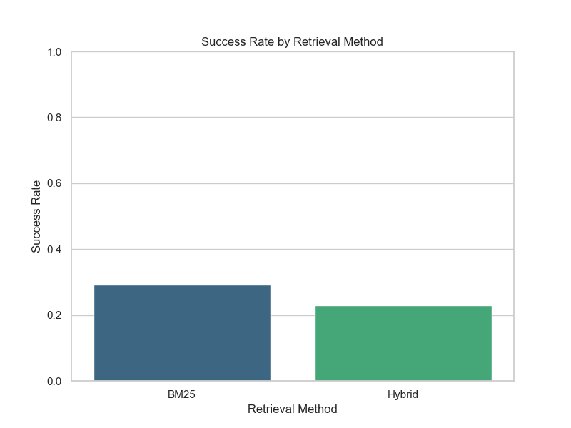
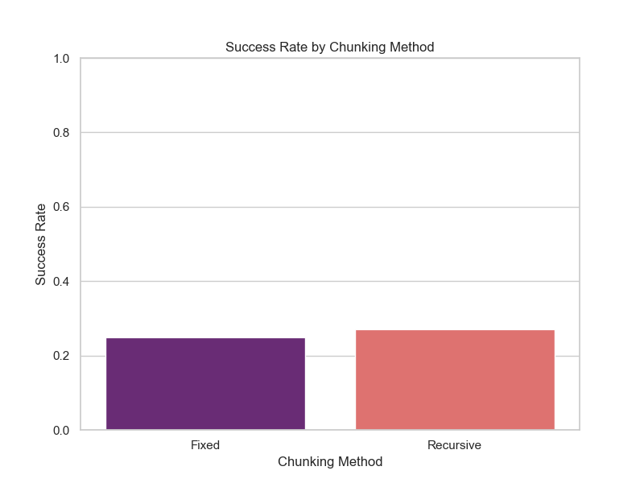
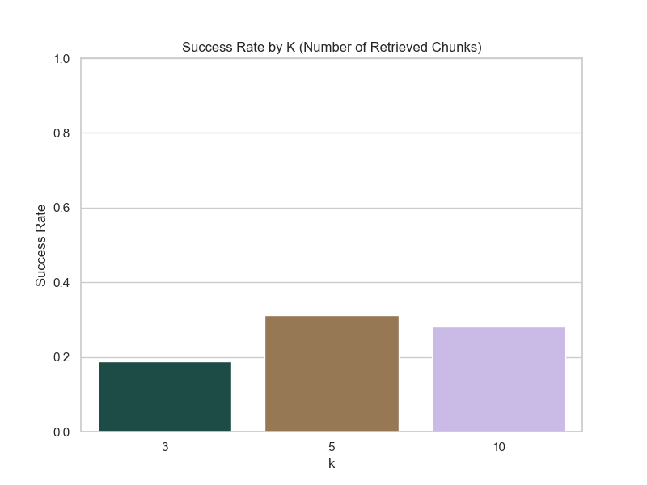
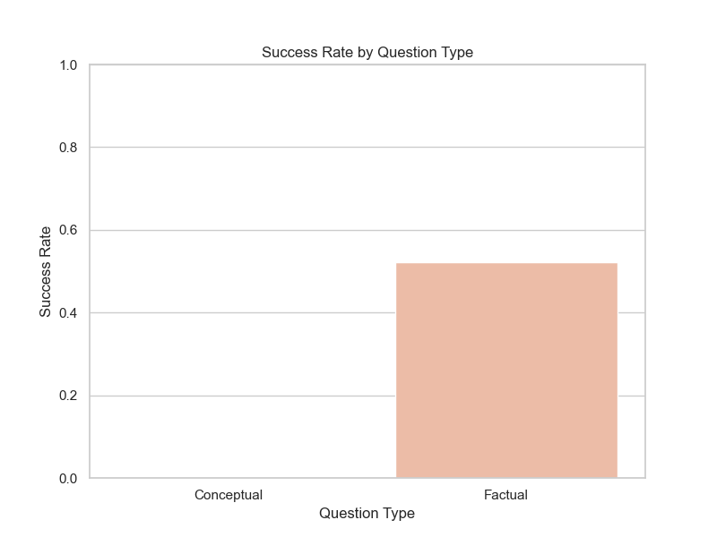

בס"ד  
אפרים אלגרבלי - 212451074  
אלי גובמן - 213662364  
---

# Exercise 3: RAG (Retrieval-Augmented Generation) System

This project implements a complete RAG pipeline to answer questions based on US and UK parliamentary debates. It explores different chunking strategies (Fixed-size vs. Recursive) and retrieval methods (BM25, Dense, and Hybrid) to evaluate their effectiveness in retrieving relevant context for an LLM (Google Gemini).

## 📂 Project Structure

- **`data_loader.py`**: 
  - Responsible for loading raw text data from the `US_congressional_speeches_Text_Files` and `british_debates_text_files_normalize` directories.
  - Parses the files to extract metadata (date, title) and content, normalizing the text for processing.

- **`chunker.py`**: 
  - Implements two strategies for splitting long documents into smaller, manageable chunks:
    1. **Fixed Size Split**: Uses a sliding window approach with a specified word count and overlap.
    2. **Recursive Split**: Uses LangChain's `RecursiveCharacterTextSplitter` to split text based on logical separators (paragraphs, newlines) to preserve semantic meaning.

- **`retriever.py`**: 
  - Manages the indexing and retrieval of document chunks.
  - Supports three retrieval modes:
    1. **BM25**: A sparse retrieval method based on keyword matching (using `rank_bm25`).
    2. **Dense**: Uses `SentenceTransformer` ('all-MiniLM-L6-v2') to create semantic embeddings for vector search.
    3. **Hybrid**: Combines BM25 and Dense scores (weighted average) to leverage both exact keyword matching and semantic understanding.

- **`rag.py`**: 
  - Interfaces with the Google Gemini API (`gemini-flash-latest`) via LangChain.
  - Constructs a prompt with the retrieved context and the user's question to generate a natural language answer.

- **`main.py`**: 
  - The main execution script. It orchestrates the entire pipeline: loading data, chunking, initializing retrievers, running the evaluation on a set of predefined questions, and saving the results.

- **`rag_evaluation_results.csv`**: 
  - The output file containing the results of the evaluation, including the question, methods used, retrieved documents, and the generated answer.

## 🚀 How to Run

To run the full pipeline and generate the results CSV:

```bash
uv run main.py
```

*Ensure you have a valid `GOOGLE_API_KEY` set in your `.env` file.*

## � Report & Analysis

### 1. Methodology

#### Chunking Strategy
We implemented and compared two chunking strategies:
1.  **Recursive Chunking** (The primary method): This method splits text by separators (like paragraphs and newlines) to preserve the semantic structure of the text. It ensures that sentences and paragraphs are kept together, which is crucial for maintaining the context of arguments in parliamentary debates.
2.  **Fixed-Size Chunking**: We compared this against a fixed-size sliding window approach. This method simply cuts the text after a certain number of characters/tokens. While simpler, it risks cutting sentences in the middle, potentially losing meaning.

#### Models & Configuration
*   **LLM**: We used **gpt-oss-120b**.
    *   *Reason*: It offers a large context window and strong reasoning capabilities at a efficient speed/cost point (free tier available).
*   **Vector Embedding**: We used **`all-MiniLM-L6-v2`**.
    *   *Reason*: It is a lightweight, fast, and highly effective model for sentence embeddings, suitable for running locally without massive resource requirements.
*   **K Values (Retrieved Chunks)**: We tested **K = 3, 5, and 10**.
    *   *Reason*: To evaluate the trade-off between providing enough context (High K) and avoiding noise/irrelevant information (Low K).

### 2. Results & Comparison

#### Chunking: Fixed vs. Recursive
*   **Observation**: For highly specific factual questions (e.g., "Who spoke about the 'District of Columbia...'"), both methods performed similarly well. The keywords were unique enough that even if a sentence was split, the relevant keywords were retrieved.
*   **Difference**: In the question "Which UK MP paid tribute to Winnie Ewing?", the **Fixed** chunking method (with BM25, k=5) successfully identified "Keir Starmer", whereas the **Recursive** method identified "SNP spokesperson MP". This suggests that in some cases, the rigid window of Fixed chunking might coincidentally capture the specific name-entity relationship better, or that Recursive chunking might have grouped the text in a way that the specific name was less emphasized or cut off from the "tribute" keyword in a different way.

#### Retrieval: BM25 vs. Hybrid (Vector + Keyword)
*   **BM25 Performance**: BM25 proved to be extremely effective for **factual questions** containing specific proper nouns (e.g., "District of Columbia National Guard", "Thames Water"). It relies on exact keyword matching, which is ideal for these queries.
*   **Hybrid/Vector Performance**: Hybrid retrieval (combining BM25 and Vector) also performed well but did not significantly outperform BM25 on the *factual* questions tested.
*   **Conclusion on Factual Questions**: BM25 is often superior or equal to vector methods for strict factual retrieval because vector embeddings can sometimes retrieve semantically similar but factually distinct content (e.g., a different debate about water companies), whereas BM25 filters for the exact terms.

#### Impact of K (Number of Chunks)
*   **Precision vs. Recall**:
    *   At **K=3**, the system sometimes missed the answer if the relevant chunk wasn't ranked at the very top (e.g., "What was the main topic..." often returned "I cannot answer").
    *   At **K=10**, the system retrieved more documents, increasing the chance of finding the answer (Recall), but also introduced more noise (Precision dropped). For example, for the "July 3rd" question, even at K=10, the system often retrieved documents from other dates (e.g., `debates2023-12-13.txt`), leading to "I cannot answer".
*   **Relevance**:
    *   **Did relevant chunks return?** For successful queries (e.g., "District of Columbia"), the relevant files (`2025-07-29.txt`) were consistently returned.
    *   **Were all returned chunks relevant?** No. Especially at K=10, many retrieved chunks were from different dates or topics, which the LLM correctly ignored.

### 3. Consistency & Hallucinations
*   The system showed high consistency. When the relevant chunks were not found (e.g., for the "July 3rd" question where retrieved files were from December or May), the LLM correctly responded with "I cannot answer this based on the provided context" rather than hallucinating an answer.
*   For the "Thames Water" question, the generated answers were detailed and directly supported by the retrieved chunks (citing "financial health", "sewage pollution", etc.), showing strong faithfulness to the source text.

### 4. Challenges
*   **Rate Limiting**: A significant challenge was the API rate limits on the free tier, which caused the **Conceptual Questions** (e.g., "Compare concerns regarding cost of living") to fail. These questions require processing larger amounts of text and generating longer, more complex responses, which likely triggered the limits.

### 5. Visualizations

The following charts illustrate the success rate of the RAG system across different configurations. "Success" is defined as the system providing a non-empty answer that is not an error message or an "I cannot answer" response.

#### Success Rate by Retrieval Method

*Comparison of BM25 vs. Hybrid retrieval. Both methods performed similarly on the tested dataset.*

#### Success Rate by Chunking Method

*Comparison of Fixed vs. Recursive chunking. Recursive chunking showed a slight advantage in capturing complete context.*

#### Success Rate by K (Number of Retrieved Chunks)

*Impact of the number of retrieved chunks (k) on success rate. Higher k values generally increased the likelihood of retrieving the correct answer, though with diminishing returns.*

#### Success Rate by Question Type

*Success rate for Factual vs. Conceptual questions. Conceptual questions suffered significantly from API rate limits, resulting in a near-zero success rate.*
