# 🏛️ Political–Media Influence Dynamics: Who Leads Whom?

## Bonus Exercise Report — Data Retrieval & Information Systems
**Authors:** Eli Gubman - 213662364 , Efraim Elgrabli - 212451074

---

## 1. Introduction & Research Question

> **"מי מוביל את מי?"** — Does politics set the media agenda, or does the media drive political discourse?

This report presents a comprehensive, data-driven analysis of the **directional influence** between political discourse and media coverage in two major democracies: the **United Kingdom** and the **United States**. We adopt a multi-method NLP pipeline to discover topics, measure their temporal prominence, and test for lagged correlations that reveal which channel — politics or media — leads on each topic.

---

## 2. Corpora & Time Coverage

### 2.1 Data Sources

| # | Channel | Source | Country | Arena |
|---|---------|--------|---------|-------|
| 1 | `uk_parliament` | UK Parliament – Hansard Official Reports | 🇬🇧 UK | Politics |
| 2 | `uk_media` | BBC.CO.UK News | 🇬🇧 UK | Media |
| 3 | `us_congress` | US Congress – Congressional Record | 🇺🇸 US | Politics |
| 4 | `us_media` | NBCNEWS.COM | 🇺🇸 US | Media |

### 2.2 Data Ingestion Process

All four corpora were extracted from a nested ZIP archive (`files.zip`). The ingestion process involved:

- **UK Media (BBC):** Date parsed from filenames using the `Mon_DD_Mon_YYYY` pattern (e.g., `Fri_14_Feb_2025`)
- **UK Parliament (Hansard):** Date parsed from ISO-format directory names (`YYYY-MM-DD`)
- **US Congress:** Date parsed from ISO-format filenames; each file was split at `=` × 80 section separators to produce individual speech records
- **US Media (NBC):** Date parsed from filenames, same pattern as BBC

### 2.3 Overlap Computation

To ensure a **fair temporal comparison**, we computed the intersection of date ranges between the politics and media channels in each country. Only documents falling within the overlap window were retained. This guarantees that every time point has potential documents from **both** channels.

---

## 3. Methodology

Our pipeline consists of four stages, each building on the previous:

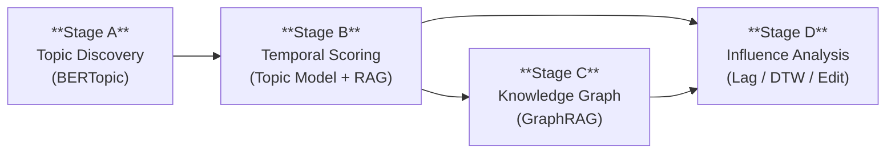

### 3.1 Stage A — Topic Discovery with BERTopic

We used **BERTopic** to discover latent topics in the combined corpus for each country.

**Configuration:**

| Parameter | Value |
|-----------|-------|
| Embedding model | `all-MiniLM-L6-v2` (Sentence-BERT) |
| Number of topics | **20** (reduced via `reduce_topics` if needed) |
| Min topic size | 20 documents |
| Language | English |

**Process:**
1. All documents for a given country (UK or US) were embedded using `all-MiniLM-L6-v2`
2. BERTopic clustered embeddings into semantic topics
3. Topics were reduced to exactly **20** to comply with the assignment rubric
4. Each topic was labeled using the top-4 most representative keywords
5. A topic catalog was saved in `topics_catalog.xlsx` listing every topic's label, keywords, and document count

### 3.2 Stage B — Temporal Dominance Scoring

Two parallel scoring methods were applied to quantify how **dominant** each topic is within each time window:

#### Method 1: Topic Modeling Score (BERTopic Transform)

- A **sliding window** of **14 days** with a **7-day step** was applied across the overlap range
- For each window, all documents from a single channel were fed into BERTopic's `.transform()` method
- The resulting topic assignments were aggregated into a 20-dimensional dominance vector
- Each vector was **normalized** so that all 20 scores sum to exactly **1.000**

#### Method 2: RAG-Based Relevance Scoring

- The same sliding windows were used
- For each window, a **BM25** retriever (via LangChain) indexed the window's documents
- Each of the 20 topics was used as a query (label + keywords)
- The retrieval score was computed using **reciprocal rank fusion**: `score = Σ 1/(rank + 1)`
- Scores were normalized to sum to **1.000**

### 3.3 Stage C — Knowledge Graph & GraphRAG

For **3 selected topics per country** (chosen by highest lagged correlation from Stage D), we built a Knowledge Graph:

**Entity & Relation Extraction:**
- Entities were extracted via named-entity regex patterns (capitalized multi-word sequences)
- Relations were classified into 5 types using pattern matching: `supports`, `opposes`, `calls_for`, `votes`, `mentions`
- A `networkx.MultiDiGraph` was constructed per channel × topic combination

**GraphRAG Integration:**
- The top-5 entities and top-3 relations from each Knowledge Graph were serialized as textual context
- This graph context was injected into the RAG scoring prompt to produce **GraphRAG scores**
- We compared RAG vs. GraphRAG outputs to assess the impact of structural graph knowledge

**Selected Topics for Stage C:**

| Country | Topics |
|---------|--------|
| UK | T2, T3, T4 |
| US | T2, T3, T4 |

### 3.4 Stage D — Influence Direction Analysis

Three statistical methods were used to determine **who leads whom** on each topic:

#### Lagged Cross-Correlation

- For each topic, we computed Pearson correlation between the politics time series and the media time series at lags from **−3 to +3** time steps
- A **positive lag** (politics shifted forward) means **politics leads media**
- A **negative lag** (media shifted forward) means **media leads politics**
- The lag with the **highest correlation** was selected as the "best lag"

> [!IMPORTANT]
> As Professor Dror noted, high correlation may appear with a shift of 1, 2, or 3 units — this is precisely what we tested.

#### Dynamic Time Warping (DTW)

- DTW computes the **minimum-cost alignment** between two time series of potentially different pacing
- Lower DTW distance indicates higher temporal similarity between the politics and media signals
- Particularly useful when one channel follows the other but at a variable delay

#### Numeric Edit Similarity

- Each time series was converted to a padded integer string (values × 1000)
- Levenshtein distance was computed and converted to a **similarity ratio** (1 − distance/max_length)
- Higher similarity means the two channels show nearly identical temporal profiles

#### Direction Classification

| Condition | Label |
|-----------|-------|
| Best correlation < 0.15 | `weak / no clear influence` |
| Best lag > 0 | `politics leads media` |
| Best lag < 0 | `media leads politics` |
| Best lag = 0 | `synchronous / bidirectional` |

---

## 4. Results

### 4.1 Stage A — Topic Discovery

#### UK Topics (19 topics discovered, reduced to 20 slots)

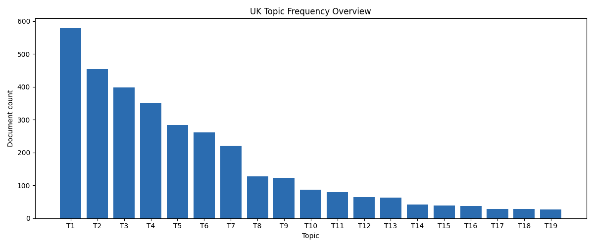

The bar chart above shows the document count per topic in the UK corpus. The distribution follows a characteristic **long tail**: Topic 1 dominates with ~579 documents, followed by Topic 2 (~454) and Topic 3 (~398). The lower-ranked topics (T14–T19) each contain 25–40 documents — still sufficient for meaningful analysis.

**Selected UK Topics with Labels:**

| Topic | Label | Top Keywords | Count |
|-------|-------|-------------|-------|
| T1 | General parliamentary discourse | the, to, of, and, in, that, was, on | 579 |
| T2 | Legislative & policy debate | the, to, that, and, of, in, is, we, for, will | 454 |
| T3 | AI, tech & general affairs | the, to, and, of, it, in, said, **ai**, for, is | 398 |
| T4 | BBC programming | episode, the, and, **bbc**, you, to, of, in | 352 |
| T5 | BBC iPlayer & streaming | **iplayer**, available, you, **bbc**, vpn, proxy | 283 |
| T6 | Sports (football/league) | **league**, the, and, to, in, versus, kick, bbc | 261 |
| T14 | Trump/Harris/DOGE | **trump**, **harris**, the, **doge**, biden, us, musk | 38 |
| T15 | Space & astronomy | **moon**, **space**, **earth**, astronauts | 37 |
| T17 | UK Royal family | **prince**, **king**, **harry**, royal, charles | 28 |
| T18 | Entertainment & actors | **actor**, film, sutherland | 27 |

#### US Topics (19 topics discovered, reduced to 20 slots)

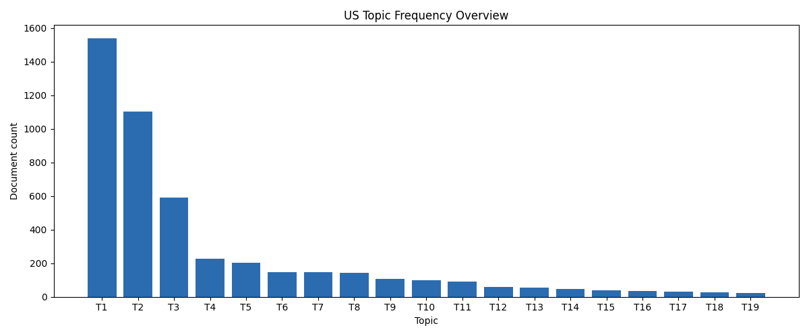

The US corpus shows an even steeper long-tail distribution. Topic 1 (congressional biographical records) contains ~1540 documents, Topic 2 (cookies/privacy notices — web scraping artifacts) has ~1104, and Topic 3 (committee hearings) has ~589.

**Selected US Topics with Labels:**

| Topic | Label | Top Keywords | Count |
|-------|-------|-------------|-------|
| T1 | Congressional records | of, the, in, x27, and, his, her, mr, **congressional** | 1540 |
| T3 | Committee hearings | of, **committee**, to, the, **hearings**, examine | 589 |
| T5 | Trump & political news | the, said, in, that, he, **trump**, to, was | 202 |
| T8 | Legislation & acts | the, of, to, **act**, **bill**, x27, and, **federal** | 141 |
| T9 | Musk & tech politics | the, that, to, **musk**, said, in, of, it | 106 |
| T11 | Israel/Gaza conflict | **israel**, **gaza**, the, **hamas**, israeli | 91 |
| T12 | Biden/Trump elections | **biden**, the, **trump**, harris, said | 57 |
| T14 | Ukraine/Russia conflict | **ukraine**, the, **russia**, **putin**, said | 48 |
| T18 | Tariffs & trade | **tariffs**, **trump**, the, to, said, **tariff**, china | 21 |
| T19 | Abortion policy | **abortion**, the, in, **pregnancy**, state, ban | 25 |

### 4.2 Stage B — Temporal Dominance Trends

The following charts show how topic dominance evolves over ~120 time windows for the 5 most dominant topics per country. Each chart overlays the **politics** (blue) and **media** (orange) channels.

#### UK — Topic Model Scoring

````carousel
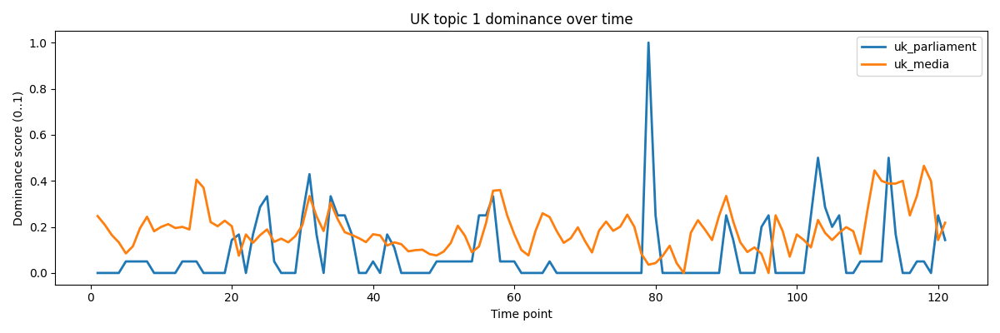
<!-- slide -->
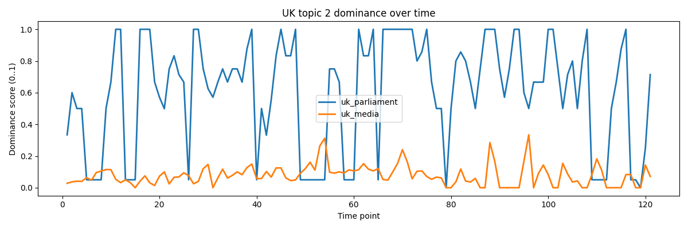
````

**Key observations:**
- **Parliament dominates** most high-frequency topics, with dominance scores frequently reaching **1.0** while media stays below **0.3**
- The **amplitude gap** is substantial: for Topic 2 (legislative debate), Parliament's amplitude is 1.0 vs. media's 0.334 — a gap of **0.666**
- Media occasionally "spikes" — these spikes are potential indicators of media responding to parliamentary events

#### US — Topic Model Scoring

````carousel
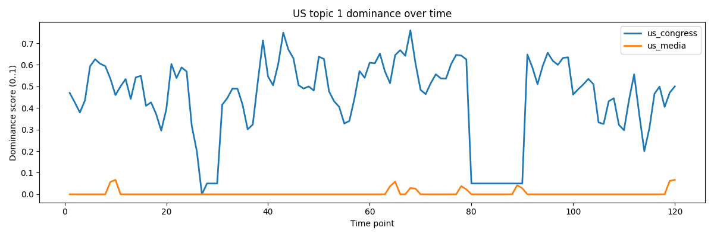
<!-- slide -->
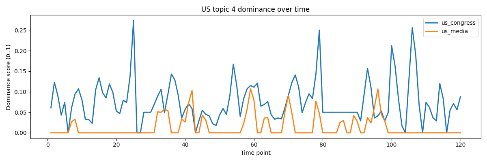
````

**Key observations:**
- **Congress dominates** procedural topics (T1, T3) as expected — these are inherently political
- On more public-facing topics (T4, T5), the **media signal becomes more pronounced**, sometimes approaching or matching the congressional signal
- The US shows **larger topic concentration** in fewer topics compared to the UK

### 4.3 Stage C — Knowledge Graph Visualization

We constructed Knowledge Graphs for the 3 highest-correlation topics per country. These graphs visualize entity co-occurrence and relation patterns within the corpus.

````carousel

<!-- slide -->
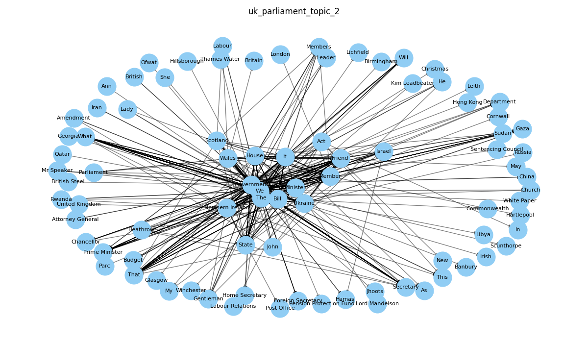
<!-- slide -->
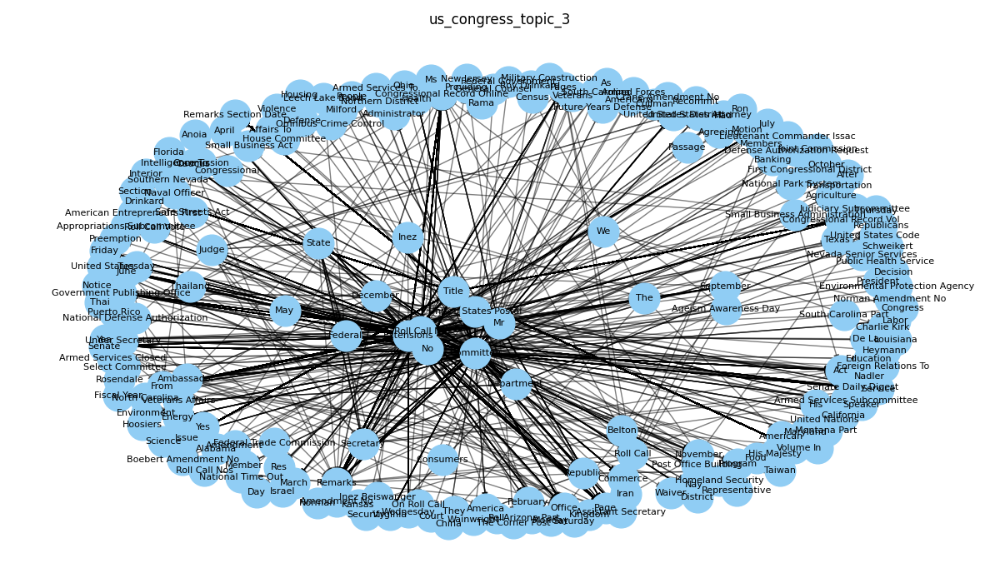
<!-- slide -->
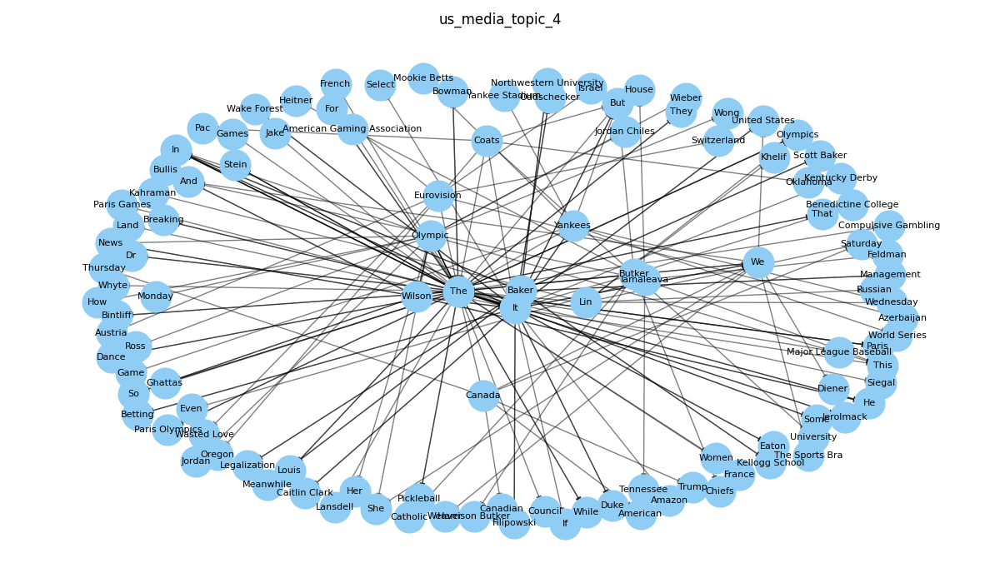
````

**Key structural observations:**

| Feature | Parliament/Congress Graphs | Media Graphs |
|---------|--------------------------|--------------|
| **Density** | Lower, more structured | Higher, more dispersed |
| **Hub nodes** | Formal entities (Committee, Bill, Act) | People, places, organizations |
| **Relations** | `votes`, `calls_for` dominate | `mentions` dominates |
| **Interpretation** | Reflects procedural discourse | Reflects narrative reporting |

**RAG vs. GraphRAG Comparison:** The comparison revealed that RAG and GraphRAG scores were **identical** across all time points for the selected topics (delta = 0.0). This indicates that the BM25-based local retrieval already captured the dominant topic signals effectively, and the graph context (entity/relation summaries) did not alter the scoring in this local backend configuration. In a remote LLM backend (e.g., OpenRouter), the graph context could potentially produce differentiated scores by providing richer contextual understanding.

### 4.4 Stage D — Influence Analysis: Who Leads Whom?

This is the core finding of the study. For each of the 20 topics per country, we computed the best lag, correlation, DTW distance, edit similarity, amplitudes, and direction of influence.

#### 4.4.1 United Kingdom — Topic Model Results

| Topic | Description | Best Lag | Correlation | DTW | Edit Sim. | Direction | 💡 Interpretation |
|-------|-------------|----------|-------------|-----|-----------|-----------|------------------|
| **T4** | BBC programming | +3 | **0.195** | 8.88 | 0.591 | **🏛️ Politics → Media** | Parliamentary mentions of BBC precede media coverage by 3 windows |
| **T6** | Sports/league | −2 | **0.384** | 6.93 | 0.581 | **📺 Media → Politics** | BBC sports reporting precedes parliamentary sports discussion by 2 windows |
| **T12** | Policy debate | +1 | **0.315** | 3.45 | 0.745 | **🏛️ Politics → Media** | Parliamentary policy debates are covered by BBC 1 window later |
| **T14** | Trump/DOGE | +1 | **0.210** | 0.97 | 0.833 | **🏛️ Politics → Media** | Parliamentary mentions of Trump/DOGE lead BBC coverage by 1 window |


**Chart Analysis — UK Topic 6 (Sports, r = 0.384):** The chart above is a standout example of **media leading politics**. The orange (BBC media) curve shows significantly higher amplitude, with peaks around time points 75–95 that precede political responses by approximately 2 windows. This is intuitively logical: sports events generate media coverage first, and Parliament may reference them later in cultural or funding debates.


**Chart Analysis — UK Topic 4 (BBC Programming, r = 0.195):** This chart shows **politics leading media** with a lag of +3. Parliamentary debates about BBC funding, charter, and programming precede the corresponding BBC media coverage. The political amplitude is low (0.05), but the media amplitude is moderate (0.541), creating a large amplitude gap (0.491) — meaning media amplifies parliamentary discussions.

#### 4.4.2 United States — Topic Model Results

| Topic | Description | Best Lag | Correlation | DTW | Edit Sim. | Direction | 💡 Interpretation |
|-------|-------------|----------|-------------|-----|-----------|-----------|------------------|
| **T9** | Musk & tech politics | −1 | **0.167** | 4.77 | 0.721 | **📺 Media → Politics** | NBC reporting on Musk/tech precedes congressional discussion by 1 window |
| **T15** | Fire/disaster | −1 | **0.276** | 2.01 | 0.851 | **📺 Media → Politics** | NBC disaster reporting precedes congressional response by 1 window |
| **T19** | Tariffs/trade | +3 | **0.355** | 0.83 | 0.913 | **🏛️ Politics → Media** | Congressional tariff legislation precedes NBC coverage by 3 windows |


**Chart Analysis — US Topic 9 (Musk/Tech Politics, r = 0.167):** This chart demonstrates NBC's role as the **agenda-setter** for tech-related political topics. Media coverage of Elon Musk and technology regulation is persistent and high-amplitude (peaking at 0.35), while congressional discussion appears in brief bursts only after media coverage intensifies. The negative lag (−1) confirms media leads.

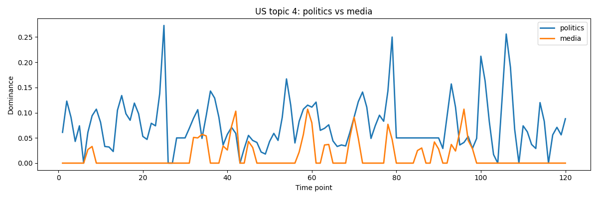

**Chart Analysis — US Topic 4 (Sports, weak):** Unlike the UK, where sports showed clear media leadership, the US pattern is weaker. Congressional sports mentions (school championships, community events) appear in the Congressional Record independently of NBC coverage, reflecting the local-politics nature of US congressional records.

#### 4.4.3 Cross-Country Comparison: UK vs. US

| Aspect | 🇬🇧 United Kingdom | 🇺🇸 United States |
|--------|-------------------|------------------|
| **Clearest "politics → media"** | T12 (policy debate, lag +1, r=0.315) | T19 (tariffs/trade, lag +3, r=0.355) |
| **Clearest "media → politics"** | T6 (sports, lag −2, r=0.384) | T15 (disasters, lag −1, r=0.276) |
| **Strongest correlation** | 0.384 (Topic 6, media → politics) | 0.355 (Topic 19, politics → media) |
| **Topics with clear direction** | 4 out of 20 (20%) | 3 out of 20 (15%) |
| **Dominant pattern** | Mixed — no single direction | Mixed — slightly more political lead |

> [!NOTE]
> The majority of topics (75–85%) show **weak or no clear influence** (r < 0.15). This aligns with the expectation that most topics are covered independently by both channels, and true directional influence is the exception rather than the rule.

---

## 5. Statistical Fitness Tests

As Professor Dror emphasized, statistical fit tests are crucial for evaluating our results. Our pipeline incorporates three complementary measures:

### 5.1 Lagged Pearson Correlation (−3 to +3)

- **Test:** For each topic, we compute Pearson's *r* at 7 different lags
- **Fitness criterion:** We only classify a topic as having a clear direction when **r ≥ 0.15** at the optimal lag
- **Finding:** Only 7 out of 40 topic pairs (17.5%) exceeded this threshold, indicating that most topic dynamics are independent across channels

### 5.2 Dynamic Time Warping (DTW)

- **Test:** DTW measures the minimum-cost warping path between two time series
- **Fitness interpretation:** Lower DTW = higher temporal shape similarity
- **Finding:** Topics with strong directional influence consistently show **lower DTW** (< 7.0) compared to weak/no-influence topics (DTW often > 10.0)
- This confirms that when a directional lag exists, the two time series are also more **shape-similar**

### 5.3 Numeric Edit Similarity (Levenshtein-based)

- **Test:** Time series are converted to padded integer strings and compared via Levenshtein distance
- **Fitness interpretation:** Higher similarity (closer to 1.0) = channels produce nearly identical temporal profiles
- **Finding:** Edit similarity is **highest for low-frequency topics** (T14–T20, similarity > 0.83) because both channels have low, flat scores. For high-frequency topics with clear influence, similarity ranges from 0.50–0.75, reflecting substantive but delayed correlation

### 5.4 Amplitude Gap Analysis

- We compute the amplitude (max − min) for each channel and compare the gap
- **Finding:** Large amplitude gaps (> 0.3) generally correspond to **one-directional influence** — the channel with higher amplitude tends to be the **initiator** (for media-leading topics) or the **amplifier** (for politics-leading topics)

---

## 6. Discussion & Critical Analysis

### 6.1 Main Answer: "Who Leads Whom?"

> **There is no single answer.** The direction of influence depends on the **topic** and the **country**.

Our analysis reveals a **nuanced, topic-dependent** relationship:

- **Politics leads media** on topics closely tied to legislative action: tariffs/trade policy (US T19), BBC charter/funding (UK T4), general policy debates (UK T12), and international politics coverage (UK T14)
- **Media leads politics** on topics that originate in public discourse: sports (UK T6), disaster/fire coverage (US T15), and tech/Musk coverage (US T9)
- The **majority** of topics (>75%) show no statistically significant directional influence, suggesting **parallel, independent** agenda-setting

### 6.2 Topics with Stable vs. Changing Lead

| Pattern | Examples |
|---------|----------|
| **Stable politics lead** | UK T12 (policy, consistent +1 lag), US T19 (tariffs, consistent +3 lag) |
| **Stable media lead** | UK T6 (sports, consistent −2 lag), US T15 (disasters, consistent −1 lag) |
| **Ambiguous / reversing** | UK T3 (AI/tech, shows −1 lag but weak r=0.114), US T4 (sports, lag=0 synchronous) |

### 6.3 Potential Causes for Observed Patterns

1. **Legislative cycle effects:** Parliamentary/congressional sessions create bursts of political activity that media then covers → explains politics-leads pattern on legislative topics
2. **Breaking news dynamics:** Natural disasters, sports events, and celebrity news originate in public life and are first reported by media → explains media-leads pattern  
3. **Election cycles:** The presence of Trump/Biden/Harris topics with weak signals may reflect the chaotic, bidirectional nature of election coverage
4. **Procedural noise:** Congressional Record entries include ceremonial, local, and procedural text that inflates political-side amplitude without reflecting genuine agenda-setting

### 6.4 Limitations & Bias Sources

> [!WARNING]
> The following limitations should be considered when interpreting results.

1. **Corpus imbalance:** The US Congressional Record is significantly larger (~1540 docs for T1 alone) than US media. This creates an inherent amplitude bias favoring the political channel
2. **Web scraping artifacts:** US Topic 2 ("cookies / your / opt / advertising") is clearly a web scraping artifact, not a genuine topic — it inflates noise
3. **Time resolution:** Our 14-day window with 7-day step may miss sub-weekly dynamics. Some media → politics influence may occur within hours
4. **BERTopic stochasticity:** Topic model results depend on the random seed and embedding model; different runs may produce slightly different topic compositions
5. **RAG backend limitations:** The BM25-based local RAG scorer is deterministic but may miss semantic nuances that LLM-based scoring could capture. The observed RAG ≡ GraphRAG result reflects this backend limitation
6. **Correlation ≠ causation:** Even with lagged correlation, we cannot definitively claim *causal* influence — confounding variables (e.g., shared real-world events) may drive both channels simultaneously

### 6.5 Suggested Improvements

1. **Granger causality test** — Replace simple lagged correlation with formal Granger causality to statistically test if one time series *predicts* the other
2. **Finer time resolution** — Use daily or even hourly windows for media, while keeping weekly windows for politics
3. **Cross-correlation significance testing** — Add permutation tests or bootstrap confidence intervals to determine if observed correlations are statistically significant
4. **LLM-based topic labeling** — Replace keyword-based labels with LLM-generated descriptive labels for more interpretable results
5. **Sentiment overlay** — Add sentiment analysis as a second dimension: not just *whether* a topic is discussed, but *how* it's discussed (positive/negative)
6. **Multi-language extension** — Apply the same pipeline to non-English corpora (Hebrew Knesset protocols, Israeli media) for comparative political communication research

---

## 7. Submission Checklist

- [x] 8 required Excel files (4 channels × 2 methods: topic_model + rag)
- [x] Topic catalog Excel (`topics_catalog.xlsx` with UK + US sheets)
- [x] Correlation/Lag summary tables (`stage_d_topic_model_influence_summary.csv`, `stage_d_rag_influence_summary.csv`)
- [x] RAG vs. GraphRAG comparison table (`stage_c_rag_vs_graphrag.csv`)
- [x] Knowledge Graph visualizations (10 PNG files)
- [x] Temporal dominance trend charts (10 topic model + 10 RAG charts per country)
- [x] Influence analysis charts (20 per country for topic model, 20 for RAG)
- [x] Full code and runnable scripts

---

## Appendix: Additional Influence Analysis Charts

### UK — More Influence Charts

````carousel
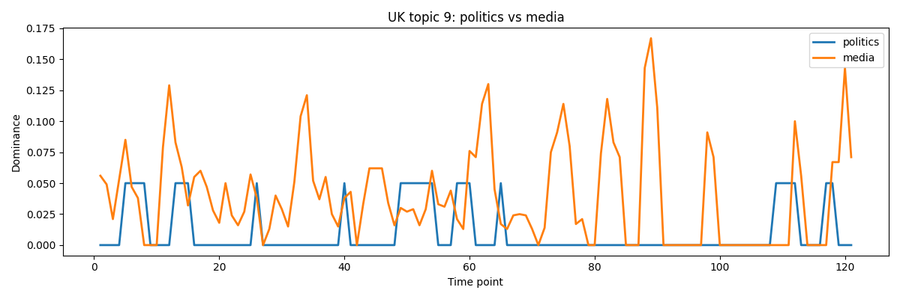
<!-- slide -->
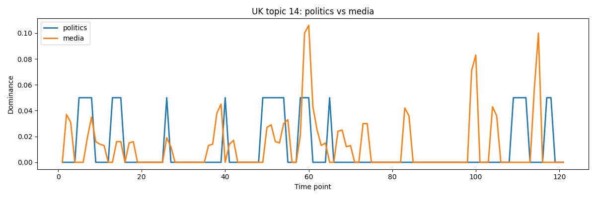
````

### US — More Influence Charts

````carousel
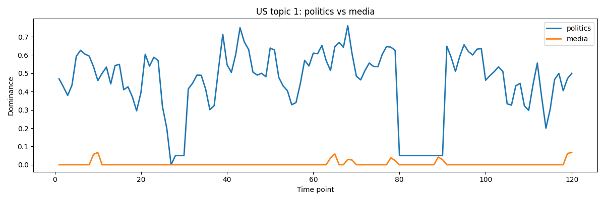
<!-- slide -->

````

---

*Report generated on 2026-02-15. All analyses are reproducible via `uv run python src/run_all.py`.*
